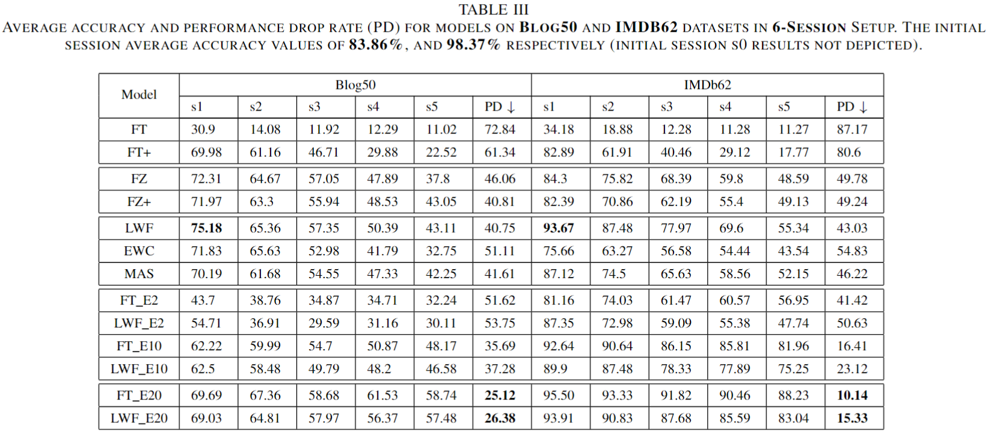
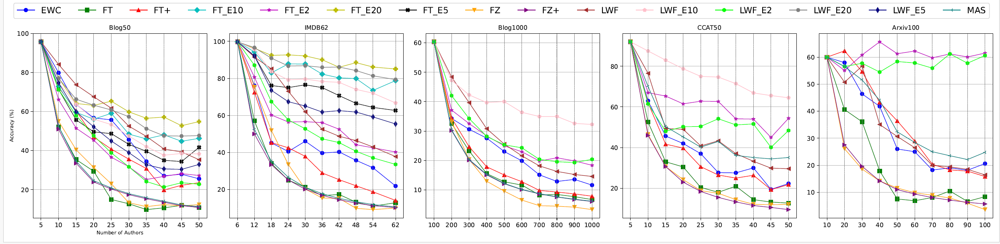

# Towards Effective Authorship Attribution: Integrating Class-incremental Learning

This repository contains the implementation of the paper "Towards Effective Authorship Attribution: Integrating Class-incremental Learning". The repository is organized as follows:

## Repository Structure

### Models
- **Base_CIL**: The parent class for class-incremental learning in authorship attribution.
- **Baselines**: Contains various implementations of fine-tuning based models.
- **LWF**: Implements Learning Without Forgetting (LWF).
- **Weight_Regs**: Contains the implementation of EWC and MAS.

### Data Provider
- Contains the implementation of exemplar providers: random, herding, and hard exemplars. Note that the paper reports results only for random exemplars.

### Analyzer
- Provides visualization tools such as confusion matrix and data statistics used in the paper.

## Scripts
- **run_baseline**: Runs all experiments for the fine-tune based models.
- **run_lwf**: Runs experiments for Learning Without Forgetting models.
- **run_weight_reg**: Runs experiments for weight regularization models.
- **Build_CIL_data**: Splits the original datasets (Blog50 and IMDB62) for class incremental learning.

Each script contains the necessary parameters for the respective models. For example, model parameters can be found in `run_baseline`.

## Trained models, results, and model predictions can be found here [link](https://drive.google.com/drive/folders/111zXVnCvimQa-TQDG5zoLyTD4iz8asL9?usp=drive_link)

